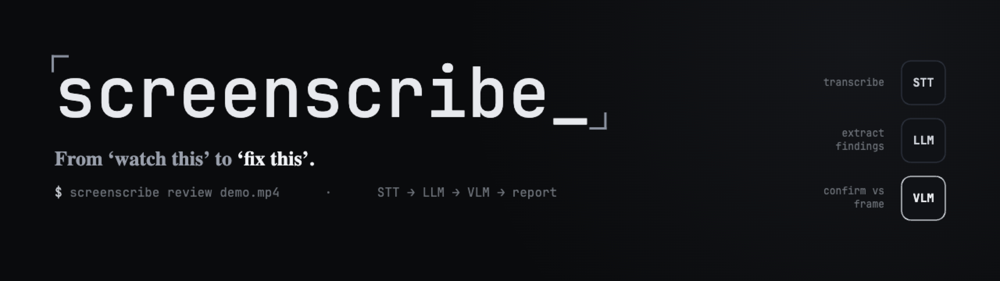
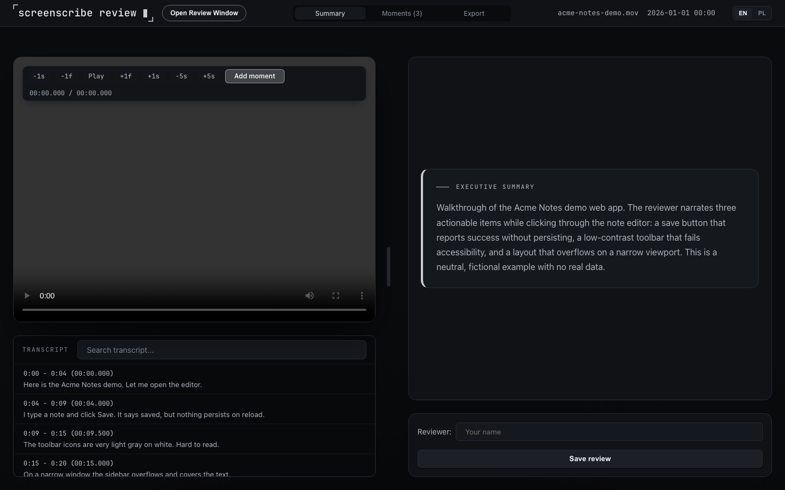
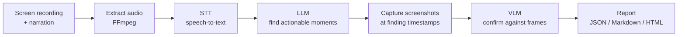

<p align="center">
  
</p>

# screenscribe

[](LICENSE)
[](https://www.python.org/)
[](https://github.com/vetcoders/screenscribe/actions/workflows/ci.yml)
[](Makefile)

**Turn screen recordings into actionable engineering reports.**

[](docs/SHOWCASE.md)

**See a live example report:** open [`examples/example_report.html`](examples/example_report.html)
in your browser (build it with `uv run python examples/generate_example.py`), or
browse the [showcase](docs/SHOWCASE.md). It is a neutral, fictional sample — no
real recordings, keys, or personal data.

Record yourself walking through your app, talk through the bugs and changes you
see, and screenscribe transcribes the narration, matches it to what is on
screen, and produces a structured report you (or your AI agent) can act on —
JSON, Markdown, and an interactive HTML report.

screenscribe runs a **STT → LLM → VLM** pipeline: speech-to-text for the
narration, a language model to find the actionable moments, and a
vision-language model to confirm them against captured frames.

> screenscribe ships with **LibraxisAI** as its first-party default provider
> (an OpenAI-compatible API). To run it yourself, bring **any OpenAI-compatible
> key** — from OpenAI or another provider — and point screenscribe at that
> endpoint with two environment variables. See [Providers](#providers).

---

## Why screenscribe

Screen recordings are a fast, natural way to report bugs and review changes —
but a video is not actionable. Someone still has to watch it, scrub to the right
moment, and write down what was said. screenscribe automates that last mile:

- **Just speak.** Narrate your recording in plain language.
- **Get structure.** Receive a report with findings, timestamps, screenshots,
  and an executive summary.
- **Hand off cleanly.** The Markdown output is designed to be readable by both
  humans and AI fixer agents.

Typical users: developers doing self-review, QA engineers filing bug demos,
product owners capturing feedback walkthroughs.

---

## Features

- **Two analysis modes**
  - `review` — automatic pipeline: transcribe → find → screenshot → confirm → report.
  - `analyze` — interactive, human-first dashboard: you scrub the video, mark
    frames, add voice/text notes, and trigger AI analysis only where it matters.
- **STT → LLM → VLM pipeline** with response-ID chaining so each stage shares
  context with the next.
- **Interactive HTML report** with synchronized video player, subtitle
  sync, screenshot annotations, and a human review workflow (on by default).
- **Transcript-first lane** (`preprocess`) — extract audio and transcribe into
  stable artifacts (TXT, timestamped TXT, segments JSON, WebVTT) before any AI
  analysis, ideal for agent handoff.
- **Batch mode** — review multiple videos with shared context across files.
- **Auto-versioning** — re-running a review preserves prior output as
  `_2`, `_3`, … instead of overwriting.
- **Checkpointing** — resume interrupted runs with `--resume`.
- **Multi-provider, OpenAI-compatible** — per-endpoint keys, endpoints, and
  models; optional opt-in STT fallback to a second provider.

---

## Requirements

- **Python 3.11+**
- **uv** for dependency sync and source-checkout commands.
  - macOS: `brew install uv`
  - Standalone installer: `curl -LsSf https://astral.sh/uv/install.sh | sh`
- **FFmpeg** (provides `ffmpeg` and `ffprobe`) — used for audio extraction and
  duration probing. Input videos can be anything FFmpeg decodes, including
  `.mp4`, `.mov`, `.mkv`, and `.webm`.
  - macOS: `brew install ffmpeg`
  - Debian/Ubuntu: `sudo apt install ffmpeg`
  - Windows: `choco install ffmpeg`
- An **API key** for an OpenAI-compatible provider (covers STT + LLM + vision).
  The self-serve path is to bring your own key from **OpenAI** (or any other
  OpenAI-compatible provider) and point the endpoints at that provider — see
  [Providers](#providers). LibraxisAI is the built-in default endpoint.

---

## Quickstart

```bash
git clone https://github.com/vetcoders/screenscribe.git
cd screenscribe
uv sync

# bring your own OpenAI-compatible key (one-time) — see Providers below to
# point at OpenAI or another provider; the default endpoint is LibraxisAI
uv run screenscribe config --init
uv run screenscribe config --set-key YOUR_API_KEY

# review a narrated screen recording
uv run screenscribe review demo.mov
```

### Providers

The self-serve way to run screenscribe is to bring your own key from an
**OpenAI-compatible provider**. Point the endpoints at that provider and set the
matching key — two variables, one coherent step. For OpenAI:

```bash
export SCREENSCRIBE_API_BASE=https://api.openai.com
export SCREENSCRIBE_API_KEY=YOUR_OPENAI_KEY   # generic key — covers STT, LLM, and vision

uv run screenscribe review demo.mov
```

Any other OpenAI-compatible endpoint works the same way: set
`SCREENSCRIBE_API_BASE` to that provider's base URL and `SCREENSCRIBE_API_KEY`
to its key.

The built-in default endpoint is **LibraxisAI**, screenscribe's first-party
OpenAI-compatible provider. If you have a LibraxisAI key, the Quickstart steps
work as-is — `config --set-key YOUR_API_KEY` is enough and you can skip the base
URL. Without one, use the OpenAI-compatible path above.

> Use `SCREENSCRIBE_API_KEY` here, not `OPENAI_API_KEY`. `OPENAI_API_KEY` only
> fills the LLM and vision keys — it leaves the STT key empty, so `review` fails
> at transcription (the first step). `SCREENSCRIBE_API_KEY` is the generic key
> all three endpoints fall back to. See [Configuration](#configuration) for
> per-endpoint keys.

> Set **both** variables together. An OpenAI key (`sk-...`) left on the default
> LibraxisAI endpoint is a key/endpoint mismatch — screenscribe will not
> silently re-route, so it warns (and the run is blocked) instead of sending
> your OpenAI key to the wrong provider. See [Configuration](#configuration) for
> the full provider/endpoint reference.

> **Billing — bring-your-own-key (BYOK).** screenscribe does not resell or proxy
> AI capacity. You bring your own provider key and you pay that provider directly
> — LibraxisAI (the default) or OpenAI — for the STT, LLM, and vision calls each
> run makes. There is no screenscribe account, subscription, or charge in
> between: the tool only forwards your requests to the endpoints you configure
> and never sees or handles payment.

screenscribe transcribes the narration, finds the actionable moments, captures
matching screenshots, confirms them with the vision model, writes the report
artifacts, and (by default) opens the interactive HTML report in your browser.

Prefer to drive the AI yourself? Use the interactive dashboard:

```bash
uv run screenscribe analyze demo.mov
```

This opens a browser where you scrub the video, mark interesting frames, add
voice or text notes, and trigger VLM analysis only on what you point at.

---

## How it works


```mermaid
flowchart LR
    A[Screen recording<br/>+ narration] --> B[Extract audio<br/>FFmpeg]
    B --> C[STT<br/>speech-to-text]
    C --> D[LLM<br/>find actionable moments]
    D --> E[Capture screenshots<br/>at finding timestamps]
    E --> F[VLM<br/>confirm against frames]
    F --> G[Report<br/>JSON / Markdown / HTML]
```

1. **Extract audio** from the video with FFmpeg.
2. **STT** transcribes the narration into timestamped segments.
3. **LLM** reads the full transcript and surfaces the actionable moments
   (bugs, changes, points of interest).
4. **Screenshots** are captured at the relevant timestamps.
5. **VLM** inspects each frame alongside the spoken context to confirm the
   finding and describe what is actually on screen.
6. **Report** artifacts are written (and optionally served in the browser).

Each stage chains a response ID into the next, so later stages reason with the
earlier context instead of starting cold.

> **Terminology — moments vs findings.** The interactive report and the
> `analyze` dashboard call these items **moments** (the "Moments" tab, the
> "Add moment" button); the data artifacts — `<video>_report.json`, the
> Markdown export, and the config flags — call the same items **findings**.
> They are one thing under two labels: moment is the UI-facing name, finding is
> the data-facing name.

---

## Commands

screenscribe ships **7 commands**. In a source checkout, prefix copy-paste
commands with `uv run` as shown below. If you installed the package or activated
its virtualenv, the bare `screenscribe` command is equivalent. Running
`screenscribe` with no command opens an interactive prompt; running
`screenscribe <video>` is a shortcut for `screenscribe review <video>`.

| Command | What it does |
|---------|--------------|
| `review` | Full automatic pipeline → interactive review report. |
| `analyze` | Interactive, human-first dashboard (FastAPI server in your browser). |
| `transcribe` | Transcribe audio to text only (no analysis). |
| `preprocess` | Build a transcript-first artifact bundle for downstream review. |
| `keywords` | Manage keywords passed to the AI as hints during detection. |
| `config` | Manage configuration and API keys. |
| `version` | Show version information. |

### `screenscribe review`

Analyze one or more screencasts and generate an interactive review report.

```bash
uv run screenscribe review demo.mov
uv run screenscribe review clip1.mov clip2.mov clip3.mov        # batch, shared context
uv run screenscribe review ./recordings/session.mov --no-serve
uv run screenscribe review demo.mov --force
uv run screenscribe review demo.mov --keywords-file my-keywords.yaml
```

By default this produces a **JSON**, **Markdown**, and interactive **HTML**
report and opens the HTML report in your browser. Key options:

- `--lang / -l` — transcription language (default `en`; pass `--lang pl` for Polish).
- `--no-serve` — write the report without starting the browser server.
- `--no-vision` (alias `--no-vlm`) — skip the visual/screenshot (VLM) step; the
  semantic LLM detection still runs.
- `--keywords-file` — per-run keywords file. Keywords are always-on AI hints
  (see [Keywords](#screenscribe-keywords) below); an empty or missing file is safe.
- `--resume` / `--force` — resume from a checkpoint, or overwrite a prior review.

See [USAGE.md](USAGE.md#screenscribe-review) for every flag.

### `screenscribe analyze`

Start the **interactive, human-first** analysis dashboard. screenscribe boots a
local FastAPI server and opens a browser with a video player where you:

- watch the video and pause at interesting moments,
- record voice comments describing issues,
- mark frames for AI analysis,
- get real-time VLM analysis on exactly the frames you choose,
- export the session as JSON or a Markdown report.

```bash
uv run screenscribe analyze demo.mov
uv run screenscribe analyze demo.mov --port 9000
uv run screenscribe analyze demo.mov --lang pl
```

The dashboard defaults to **English** (`--lang en`); a PL/EN toggle switches the
UI and the language used for new frame analyses. This is the recommended mode
when you want to guide the AI instead of letting it process the whole video
blindly — and it works even on recordings with **no audio track**.

### `screenscribe transcribe`

Transcribe a video's audio to plain text, with no analysis.

```bash
uv run screenscribe transcribe demo.mov                 # print to stdout
uv run screenscribe transcribe demo.mov -o transcript.txt
uv run screenscribe transcribe demo.mov --local --lang en
```

### `screenscribe preprocess`

Build a **transcript-first artifact bundle** — the non-AI handoff lane. Extracts
audio, transcribes it, and writes stable transcript artifacts, then stops before
any semantic or vision analysis.

```bash
uv run screenscribe preprocess demo.mov
uv run screenscribe preprocess demo.mov -o ./demo_preprocess
uv run screenscribe preprocess demo.mov --no-audio --lang en
```

Output bundle: `transcript.txt`, `transcript.timestamped.txt`,
`transcript.segments.json`, `transcript.vtt`, a `preprocess.json` manifest, and
(by default) the extracted `audio.mp3`.

### `screenscribe config`

Manage configuration and API keys. The config file lives at
`~/.config/screenscribe/config.env`.

```bash
uv run screenscribe config --show           # display current configuration
uv run screenscribe config --init           # create a default config file
uv run screenscribe config --set-key YOUR_API_KEY # save an API key
```

You can also open the config in your editor with `uv run screenscribe --config`.

### `screenscribe keywords`

**Keywords are always-on hints for the AI.** They are a dictionary of
the words and phrases your team uses to describe problems (e.g. "klikam i nic" =
bug, "potworek" = UI, "za ciężkie" = perf). During detection screenscribe passes
them to the LLM as *hints* — they never replace the semantic analysis, never
auto-create a finding on their own, and an empty or missing dictionary is a safe
no-op. They are used by default if present.

The active dictionary is a single global file at
`~/.config/screenscribe/keywords.yaml`. It groups phrases under six categories
(`bug`, `change`, `ui`, `performance`, `accessibility`, `other`) and may mix
languages. A built-in default is used until you create your own.

```bash
uv run screenscribe keywords init                 # create the global file from defaults
uv run screenscribe keywords edit                 # open it in $EDITOR
uv run screenscribe keywords add bug "klikam i nic" # append one phrase to a category
uv run screenscribe keywords list                 # show the active dict + per-category counts
```

For a one-off run with a different keywords file, pass `--keywords-file /path` to
`review` or `analyze` instead of editing the global file.

### `screenscribe version`

```bash
uv run screenscribe version
uv run screenscribe --version    # short form
```

---

## Configuration

screenscribe is configured via environment variables or a config file at
`~/.config/screenscribe/config.env` (created by `uv run screenscribe config --init`).
Environment variables always override the config file.

### API key

Set any one of these — the first non-empty value wins:

```bash
export SCREENSCRIBE_API_KEY=YOUR_API_KEY   # generic key (all endpoints)
export OPENAI_API_KEY=YOUR_OPENAI_KEY      # → LLM + vision
export LIBRAXIS_API_KEY=YOUR_LIBRAXIS_KEY  # → STT (and generic fallback)
```

For multi-provider setups you can set per-endpoint keys explicitly:
`SCREENSCRIBE_STT_API_KEY`, `SCREENSCRIBE_LLM_API_KEY`,
`SCREENSCRIBE_VISION_API_KEY`.

> **Note:** `OPENAI_API_KEY` fills the LLM/vision keys but does **not** change
> the endpoints, which default to LibraxisAI. Setting only `OPENAI_API_KEY`
> therefore sends your OpenAI key to the LibraxisAI endpoint. screenscribe does
> not re-route silently — it emits a key/endpoint mismatch warning. To use
> OpenAI directly, also point the endpoints at `https://api.openai.com` (via
> `SCREENSCRIBE_API_BASE` or the explicit `SCREENSCRIBE_*_ENDPOINT` vars).

### Endpoints

Point screenscribe at any OpenAI-compatible provider. Either set a base URL and
let it derive the standard paths, or set each endpoint explicitly:

```bash
# Derive endpoints from a base URL
export SCREENSCRIBE_API_BASE=https://api.openai.com

# Or set explicit full URLs
export SCREENSCRIBE_STT_ENDPOINT=https://api.openai.com/v1/audio/transcriptions
export SCREENSCRIBE_LLM_ENDPOINT=https://api.openai.com/v1/responses
export SCREENSCRIBE_VISION_ENDPOINT=https://api.openai.com/v1/responses
```

The LLM and vision endpoints use the **Responses API** (`/v1/responses`), which
enables response-ID chaining across pipeline stages. The default provider is
LibraxisAI (`https://api.libraxis.cloud`); override the variables above to use
OpenAI or any compatible provider.

### Models

```bash
export SCREENSCRIBE_STT_MODEL=whisper-1
export SCREENSCRIBE_LLM_MODEL=gpt-4o          # provider-specific
export SCREENSCRIBE_VISION_MODEL=gpt-4o       # provider-specific
```

Defaults: STT `whisper-1`, LLM and vision `programmer` (the LibraxisAI
default — change these to your provider's model names, e.g. `gpt-4o`).

### Processing options

```bash
export SCREENSCRIBE_LANGUAGE=en               # default transcription language (use pl for Polish)
export SCREENSCRIBE_VISION=true               # enable visual/screenshot (VLM) analysis (false = LLM-only)
export SCREENSCRIBE_LLM_MERGE=true            # semantic LLM-merge of near-duplicate findings (false = heuristic-only dedup)
```

### Optional STT fallback (opt-in)

You can configure a **second** STT provider that is tried only when the primary
STT endpoint fails (e.g. a rate limit). It is off by default because a fallback
routes your audio to another provider — set all three to enable:

```bash
export SCREENSCRIBE_STT_FALLBACK_ENDPOINT=https://api.openai.com/v1/audio/transcriptions
export SCREENSCRIBE_STT_FALLBACK_API_KEY=YOUR_OPENAI_KEY
export SCREENSCRIBE_STT_FALLBACK_MODEL=whisper-1
```

See [USAGE.md](USAGE.md) for the full configuration reference and troubleshooting.

---

## Language defaults

screenscribe was built international-first, with Polish available as an opt-in:

- `analyze`, `review`, `transcribe`, and `preprocess` all default to **English**
  (`--lang en`); `analyze` additionally offers a PL/EN toggle in the UI.
- Pass `--lang pl` (or set `SCREENSCRIBE_LANGUAGE=pl`) for Polish.

---

## Output artifacts

A `review` run writes, per video, into the output directory:

- `<video>_report.json` — machine-readable findings, transcript, and summary.
- `<video>_report.md` — human- and agent-readable Markdown report.
- `<video>_report.html` — interactive HTML report (video player, subtitle
  sync, annotations, human review workflow).
- captured screenshots for each finding.

A `preprocess` run writes a transcript-first bundle (`transcript.txt`,
`transcript.timestamped.txt`, `transcript.segments.json`, `transcript.vtt`,
`preprocess.json`, and optionally `audio.mp3`).

---

## Documentation

- [USAGE.md](USAGE.md) — comprehensive command and flag reference, workflows,
  and troubleshooting.
- [docs/ARCHITECTURE.md](docs/ARCHITECTURE.md) — pipeline, servers, report layer,
  CLI, and module map for developers and contributors.
- [docs/SHOWCASE.md](docs/SHOWCASE.md) — feature showcase and sample artifacts.
- **See an example report:** [`examples/`](examples/) — a neutral sample report
  ([JSON](examples/example_report.json), [VTT](examples/example_transcript.vtt));
  run `uv run python examples/generate_example.py` to build the self-contained
  interactive HTML and open it in a browser.
- [CHANGELOG.md](CHANGELOG.md) — release history.

## Contributing

Contributions are welcome. See [CONTRIBUTING.md](CONTRIBUTING.md) to get started,
and please review our [Code of Conduct](CODE_OF_CONDUCT.md). To report a security
issue, see [SECURITY.md](SECURITY.md).

## License

MIT — see [LICENSE](LICENSE).

---

Built by [Vetcoders](https://github.com/vetcoders).
